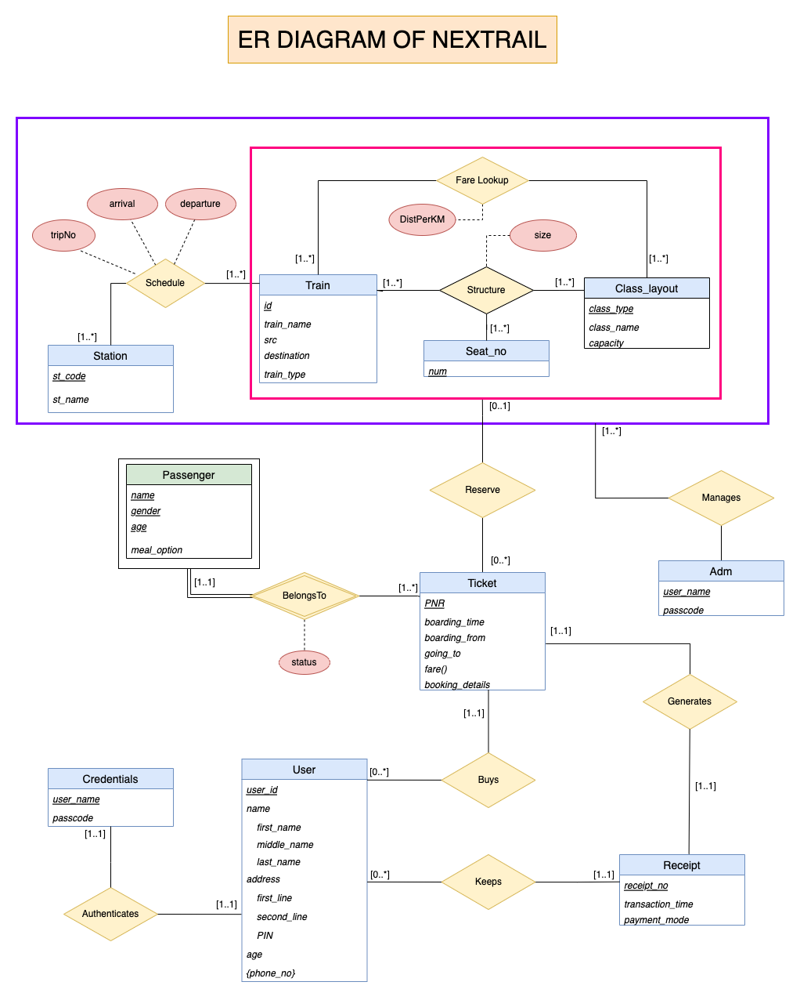
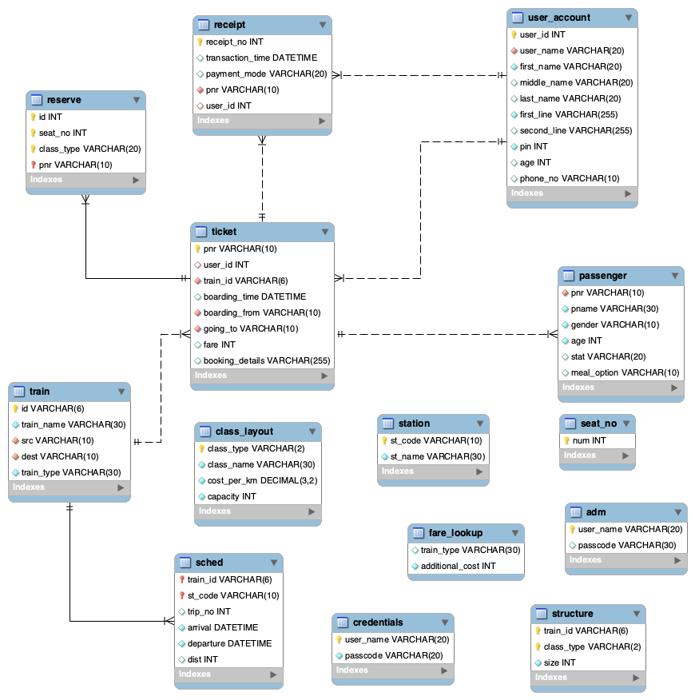

# <center> 🚆🚂 **NEXT**_RAIL_ 🚂🚆 </center>
A railway reservation system made as the course project for DBMS/CSE202 made using MySQL. <br><br>


## <B> Diagrams </B> 📊 <br>
1) ### Entity-relationship Diagram
    
    ```
    Railway-Reservation-System/Diagrams/Enitity_Relation_Diagram.png
    ```
    <br>

    

<br>

2) ### Relational Schema
    
    ```
    Railway-Reservation-System/Diagrams/Relational_Schema.png
    ```
    <br>
    
    

<br>

## <B> Database Creation </B>💾
Run creation.sql script located at the below path to create the tables for all the Enitities in our Database

    Railway-Reservation-System/SQL/Creation.sql

<br>

## <B> Data Population </B>👨‍👨‍👦‍👦🚂
Populate the tables with data to further use them for querying using the script sampleData.sql

    Railway-Reservation-System/SQL/sampleData.sql

<br>

## <B> Querying the Database </B> 🤷‍♂️
Run the queries located in Queries.sql script located at the below path to run the following queires <br>
1) To check validity of a username
2) To authenticate a user?
3) Query for trains given a route and a date
4) Query for the available number of seats given train, route, date and class
5) Query to sort the running trains on the basis of arrival time
6) Query to sort the running trains on the basis of dept time
7) Query to sort the running trains on the basis of total time
8) Query the cost/fare of a ticket per passenger
9) query for the status of a ticket given pnr
10) query all the tickets booked by a user

    ``` 
    Railway-Reservation-System/SQL/Queries.sql
    ```

<br>

## <B> Project Report </B> 📜 <br>
    Railway-Reservation-System/NEXTRAIL_ProjectReport.pdf


*****

<p align="center">
Made with ❤️ <br>
<B> Aadit Kant Jha • Abhik S. Basu • Mohit Jain • Sohum Sikdar </B>
</p>
